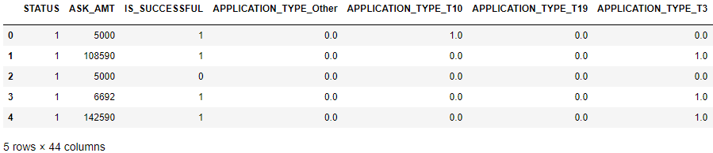
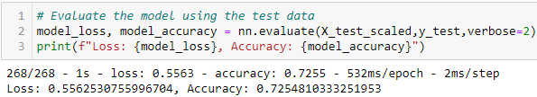
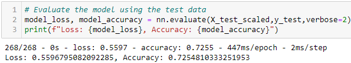
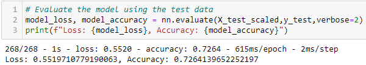
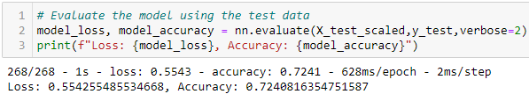

# Neural Network Charity Analysis • • • • •  ⚫
## Overview of the Analysis

This report presents machine learning and neural networks analysis of over 34,000 lines of data to create a binary classifier capable of predicting whether applicants will be successful if funded by Alphabet Soup.

## Results

⚫ <b>Data Preprocessing</b>

The following variable is considered as the target of the analysis:

• <b>IS_SUCCESSFUL</b> - whether or not the money was used successfully

The following variables are considered as the features of the analysis:

  • <b>APPLICATION_TYPE</b> - Alphabet Soup application type

  • <b>AFFILIATION</b> — Affiliated sector of industry

  • <b>CLASSIFICATION</b> — Government organization classification

  • <b>USE_CASE</b> — Use case for funding

  • <b>ORGANIZATION</b> — Organization type

  • <b>STATUS</b> — Active status

  • <b>INCOME_AMT</b> — Income classification

  • <b>SPECIAL_CONSIDERATIONS</b> — Special consideration for application

  • <b>ASK_AMT</b> — Funding amount requested

The following variables are neither targets nor features and are being removed fron the input analysis:

  • <b>EIN</b> - Unique identification number

  • <b>NAME</b> — Name of donor
  
Here is what the first five rows of the DataFrame looks like after initial processing:

⚫ <b>Compiling, Training, and Evaluating the Model</b>

How many neurons, layers, and activation functions did you select for your neural network model, and why?

• The initial analysis will include two (2) hidden layers. The first layer will include 80 neurons and the second layer will include 30 neurons. Initial input functions for the hidden layers are ReLU and the function for the outpuut layer is sigmoid. I selected these number of layers, number of neurons, and functions to be used because they were suggested in the starter code. With 5,981 paramaters, this formulation was complex enough so that strong results would likely to be achieved, but no so complex that computational time would not be excessive and there would be a lower risk of overfitting. Here are the results of the initial analysis:

The initial accuracy is approximately 72.5%. Our goal is to achieve an accuracy of 75% or better. 

To improve accuracy, we could consider several options, with a few to consider as follows:

• Adding a third layer
• Increasing number of neurons per layer
• Changing the input functions to be used

We will add a third layer, and increase the number of neurons to 100 and 50 for the first and second layers, respectively, and add 30 neurons for the third layers. This resulted in 11,011 parameters. Here are the results:

The accuracy remained essentially unchanged at 72.5%. Therefore, adding an additional layer and more neurons does not improve accuracy. Computational time increases with no benefit to the final results.

In the next test, we go back to inputs of the original analysis, using two hidden layers with 80 and 30 neurons, respectively. However, we change the input functions of the hidden layers from ReLU to tanh. Here are the results:

There is only a modest increase in accuracy to 72.7%, so the improvement in results by changing the input function is relatively negligible. 

Changing both of the input functions to sigmoid yields about the same results, at 72.6%:

One more change considered was increasing the number of bins for <b>APPLICATION_TYPE</b> by putting only those values with less than 10 in the "Other" bin (rather than under 200) and increasing the number of bins for <b>CLASSIFICATION</b> by putting only those values with less than 100 in the "Other" bin (rather than under 1000). This yielded an accuracy of %72.4%, about the same or slightly worse, so increasing bin size would not be an advisable strategy.

Were you able to achieve the target model performance?
What steps did you take to try and increase model performance?
