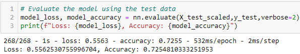

# Neural Network Charity Analysis • • • • •  ⚫
## Overview of the Analysis

This report presents machine learning and neural networks analysis of over 34,000 lines of data to create a binary classifier capable of predicting whether applicants will be successful if funded by Alphabet Soup.

## Results

⚫ <b>Data Preprocessing</b>

The following variable is considered as the target of the analysis:

• <b>IS_SUCCESSFUL</b> - whether or not the money was used successfully

The following variables are considered as the features of the analysis:

  • <b>APPLICATION_TYPE</b> - Alphabet Soup application type

  • <b>AFFILIATION</b> — Affiliated sector of industry

  • <b>CLASSIFICATION</b> — Government organization classification

  • <b>USE_CASE</b> — Use case for funding

  • <b>ORGANIZATION</b> — Organization type

  • <b>STATUS</b> — Active status

  • <b>INCOME_AMT</b> — Income classification

  • <b>SPECIAL_CONSIDERATIONS</b> — Special consideration for application

  • <b>ASK_AMT</b> — Funding amount requested

The following variables are neither targets nor features and are being removed fron the input analysis:

  • <b>EIN</b> - Unique identification number

  • <b>NAME</b> — Name of donor

⚫ <b>Compiling, Training, and Evaluating the Model</b>

How many neurons, layers, and activation functions did you select for your neural network model, and why?

• The initial analysis will include two (2) layers. The first layer will include 80 neurons and the second layer will include 30 neurons. I selected these numbers because they were suggested in the starter code. Here are the results of the initial analysis:

Were you able to achieve the target model performance?
What steps did you take to try and increase model performance?
